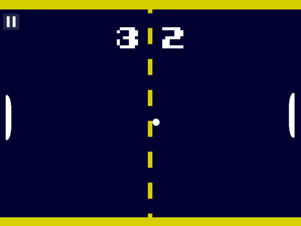

			 # **ft_transcendence**

The microservice project is created with Fastify for node.js as backend. Typescript and Tailwind CSS for frontend. For game play and graphics Babylon.js is used.

Below are the features available for the game.

* Users can participate in a live Pong game against another player directly on the website. Two players can use the same keyboard to compete against each other.
* A player can play against another, and a tournament system is available. This tournament can consist of multiple players who can take turns playing against each other. Can display who is playing against whom and the order of the play.
* Matchmaking system: the tournament system can organize the matchmaking of the participants, and announce the next match.
* Remote authentication is availabe with Google Sign-in and JWT Security module is implemented along with two factor authentication.
* The player can live chat with each other.
* AI player is availabe so that we can play single play with AI.
* User game stats and dashboard along with customization option is available on the game.
