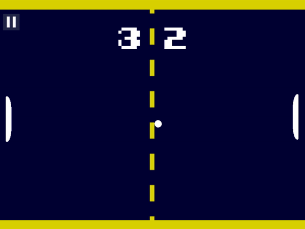

<h1 align="center">ft_transcendence</h1>

<p align="center">
  
</p>

<p align="center">
  🚀 <strong>Microservice platform built with Fastify on Node.js.</strong><br>
  🎨 <strong>TypeScript + Tailwind CSS single-page frontend.</strong><br>
  🕹️ <strong>Gameplay and graphics rendered with Babylon.js.</strong><br>
  🐳 <strong>Fully containerised with Docker Compose over HTTPS.</strong>
</p>

<p align="center">
  
  
  
  
  
  
  
</p>

## Features

* **Live local Pong** — two players share the same keyboard and compete on a 3D Babylon.js court.
* **Remote multiplayer** — real-time online matches over Socket.IO with an online-match lobby.
* **Tournament system** — multi-player brackets with automatic matchmaking, match ordering, and a tournament-bracket view that announces the next match.
* **AI opponent** — single-player mode against a built-in AI with human-like input timing.
* **Authentication** — Google OAuth2 sign-in, JWT sessions, bcrypt-hashed passwords, and TOTP-based two-factor authentication (speakeasy + QR code enrolment).
* **Email verification** — transactional mail via Nodemailer for account activation and 2FA flows.
* **Live chat** — in-game chat service for player interaction.
* **Profiles & dashboard** — avatar uploads, match history, stats, leaderboard, and customisation settings.
* **HTTPS everywhere** — every service runs behind TLS using locally generated certificates.

## Architecture

The project is split into an SPA frontend and four Fastify microservices, each with its own SQLite database and Docker image. A gateway container serves the SPA and reverse-proxies traffic to the backend services over the internal `pong-network`.

```
                ┌────────────────────────┐
                │   Browser (HTTPS)      │
                └───────────┬────────────┘
                            │ :3000
                ┌───────────▼────────────┐
                │  gateway-service       │  Fastify + Vite build, @fastify/http-proxy
                │  (frontend + proxy)    │  Babylon.js · TypeScript · Tailwind
                └───┬───────┬───────┬────┘
          :3001    │       │       │   :3004
       ┌───────────▼┐ ┌────▼─────┐ │  ┌──────────────┐
       │ auth-      │ │ user-    │ │  │ game-service │
       │ service    │ │ service  │ │  │ Socket.IO    │
       │ JWT · 2FA  │ │ profiles │ │  │ tournaments  │
       │ Google OAuth│ │ uploads │ │  └──────────────┘
       └────────────┘ └──────────┘ │        :3003
                               ┌───▼──────────┐
                               │ chat-service │
                               │ Socket.IO    │
                               └──────────────┘
```

| Service | Port | Responsibilities | Key libraries |
|---|---|---|---|
| `gateway-service` (frontend) | 3000 | Serves the Vite-built SPA, terminates TLS, proxies `/auth`, `/user`, `/chat`, `/game` to the right backend. | fastify, @fastify/http-proxy, @fastify/static |
| `auth-service` | 3001 | Sign-up/sign-in, JWT issuing, Google OAuth2, 2FA (TOTP + QR), email verification. | @fastify/jwt, @fastify/oauth2, bcryptjs, speakeasy, qrcode, nodemailer, sqlite3 |
| `user-service` | 3002 | Profiles, avatars, friends, match history, stats. | fastify, sqlite3, multipart uploads |
| `chat-service` | 3003 | Real-time chat channels and direct messages. | fastify, socket.io, sqlite3 |
| `game-service` | 3004 | Pong game rooms, matchmaking, tournament brackets, score persistence. | fastify, fastify-socket.io, socket.io, sqlite3 |

Client-side, the SPA lives under `frontend/src`:

* `pages/` — route-level views: `LoginPage`, `DashboardPage`, `ProfilePage`, `SettingsPage`, `GameMenuPage`, `SharedGamePage`, `RemoteGamePage`, `OnlineMatchLobbyPage`, `TournamentSetupPage`, `TournamentBracketPage`, `LeaderboardPage`, `ChatPage`, `EmailVerificationPage`.
* `babylonjs/` — 3D engine: `RenderEngine`, `PongManager`, `GameStateManager`, `PhysicsSystem`, `InputManager`, `AIPlayer`, `TournamentManager`, `ScoreManager`, `UIManager`, `GuiManager`, `AudioManager`, `GameObject3d`.
* `router/` — client-side SPA routing.

## Tech Stack

* **Frontend:** TypeScript, Vite, Tailwind CSS, Babylon.js (`@babylonjs/core`, `gui`, `loaders`), Socket.IO client
* **Backend:** Node.js, Fastify 4/5, Socket.IO, SQLite3
* **Auth:** @fastify/jwt, @fastify/oauth2 (Google), bcryptjs, speakeasy (TOTP), qrcode, nodemailer
* **Infra:** Docker, Docker Compose, self-signed TLS certificates, isolated `pong-network` bridge, per-service named volumes

## Getting Started

### Prerequisites

* Docker Desktop (the Makefile will try to start it on macOS if it isn't already running)
* `make`, `bash`, and `openssl` (used by `ssl-setup.sh`)
* Per-service `.env` files under `services/<name>/.env` (OAuth client ID/secret, JWT secret, SMTP credentials, etc.)

### Run

```sh
make          # generate SSL certs and docker compose up --build
make clean    # stop containers and drop volumes
make fclean   # clean everything, including images
make re       # fclean + rebuild from scratch
```

Once the stack is up, open **https://localhost:3000** in your browser (accept the self-signed certificate warning on first visit).

## Project Layout

```
ft_transcendence/
├── Makefile              # orchestrates ssl-setup + docker compose
├── docker-compose.yml    # 5 services + init container + named volumes
├── ssl-setup.sh          # generates local TLS certs into ./certs
├── frontend/             # Vite SPA (TypeScript, Tailwind, Babylon.js)
│   └── src/{pages,babylonjs,router,utils}
└── services/
    ├── auth-service/     # JWT · Google OAuth · 2FA · email
    ├── user-service/     # profiles, uploads, stats
    ├── chat-service/     # realtime chat (Socket.IO)
    └── game-service/     # Pong rooms, matchmaking, tournaments
```
